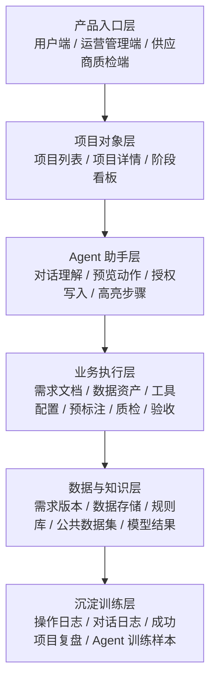
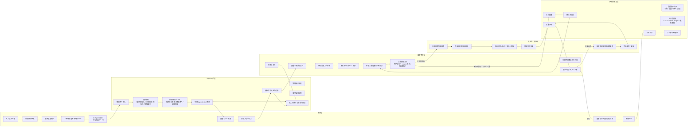
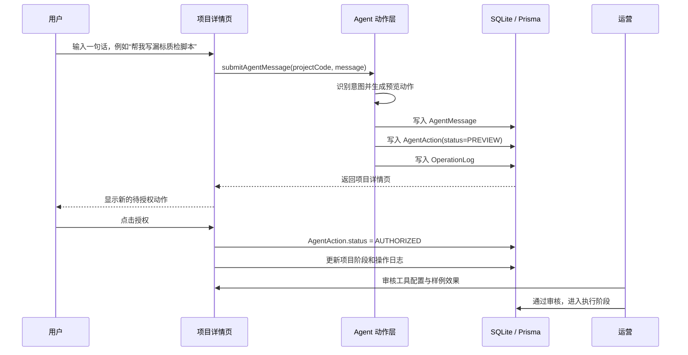
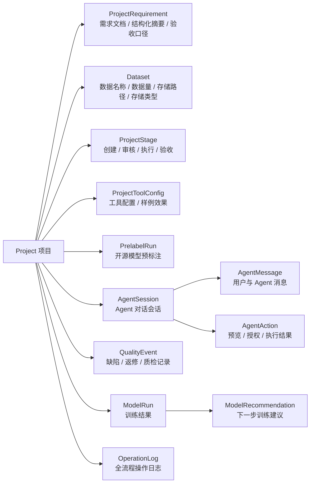

# 数据标采 Agent 项目流程图

## 1. 分层总览



## 2. 用户到任务完成泳道图



## 3. 当前项目已实现的最小闭环



## 4. 关键对象关系



## 5. 功能清单按列拆解

| 列 | 当前功能 | 下一步功能 |
|---|---|---|
| 用户端 | 新建项目、选择数据资产、查看项目详情、Agent 对话、授权预览 | 上传需求文档、预览版本差异、确认验收、查看训练建议 |
| Agent 助手层 | 根据用户输入生成 AgentAction 预览、记录消息、等待授权 | 接真实 LLM、生成字段 diff、生成工具配置、生成质检脚本、调用开源模型 |
| 运营管理端 | 查看项目列表、审核工具配置、通过审核进入执行 | 审核需求版本、审核 AC 验收条款、分配供应商、处理返修、结算复核 |
| 供应商 / 质检端 | 规划中 | 接任务、看规则、提交结果、接收质量事件、返修复检 |
| 数据与模型层 | 数据资产字段、PDF 版本、预标注预览、训练结果展示 | 公共数据集检索、真实文件存储、模型训练记录、badcase 分析 |
| 沉淀训练层 | 操作日志、Agent 消息、AgentAction | 成功项目复盘、脱敏训练样本、Skill 市场、Agent 能力迭代 |
```